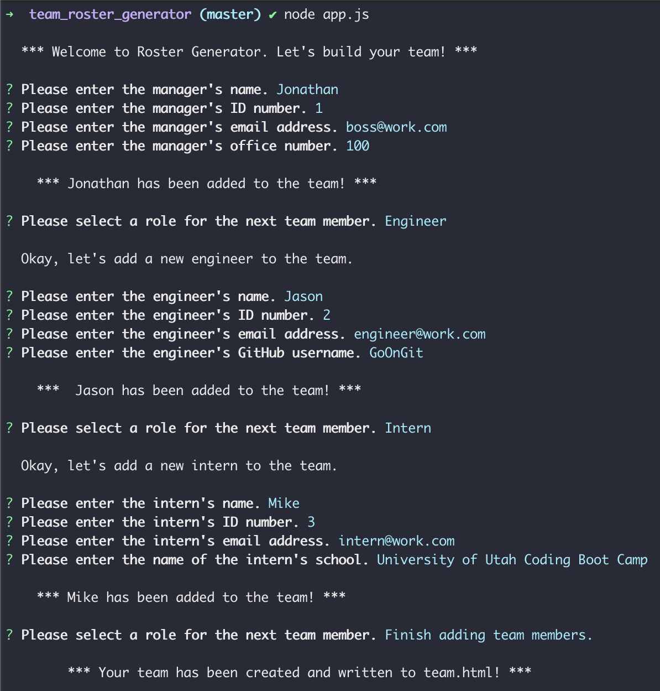

  # Team Roster Generator  
  ##    
  ## Description  
  A Node.js CLI application that asks the user a series of questions to dynamically create an HTML file that displays a summary of information for each member of a team.  
  ## Table of Contents  
  * [Installation](#installation)  
  * [Usage](#usage)  
  * [License](#license)  
  * [Contributing](#contributing)  
  * [Tests](#tests)  
  * [Video](#video)  
  * [Screenshots](#screenshots)  
  * [Questions](#questions)  
  ## Installation  
  Navigate to the desired directory using your computer's terminal app and enter "git clone git@github.com:mjgross82/team_roster_generator.git". Then enter "npm i" to install required node modules.  
  ## Usage  
  Navigate to the team_roster_generator directory using your computer's terminal app and enter "node app.js". The app will ask you a series of questions and then dynamically generate a team.html file in the team_roster_generator/output folder based on your responses.  
  ## License  
  This project is licensed under the MIT license.  
  ## Contributing  
  Please feel free to contact me using the contact information provided below if you would like to contribute to the project or request additional functionality.  
  ## Tests  
  This project was created using test driven development. Enter the command "npm test" in the team_roster_generator directory to see that the application passes a total of 17 tests across 4 test suites which can be reviewed in the test subdirectory.  
  ## Videos  
    
  [YouTube Demonstration](https://youtu.be/R1IvgRLmuYI)  
  ## Screnshots  
    
    
  ## Questions  
  If you have any questions regarding this project, please contact me at:  
  GitHub: [mjgross82](https://github.com/mjgross82)  
  Email: [mjgross82@pm.me](mailto:mjgross82@pm.me)
  